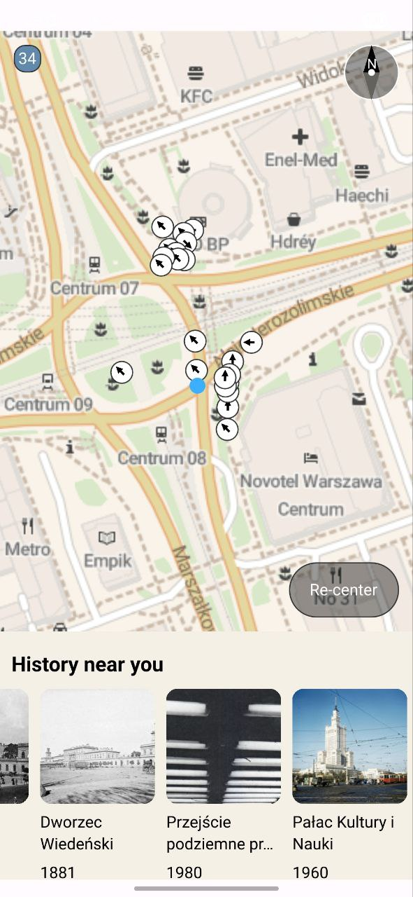

# PastViewer

A cross-platform mobile application for viewing historical photographs on an interactive map. Built with Qt 6 and QML, PastViewer allows you to explore geotagged historical images with an intuitive map interface.

## Screenshots

<p align="center">
  
  
</p>

## Requirements

### All Platforms
- **CMake** 3.28 or later
- **Qt 6.9.2** or later with the following modules:
  - Qt6::Core
  - Qt6::Quick
  - Qt6::QuickControls2
  - Qt6::QuickLayouts
  - Qt6::Location
  - Qt6::Positioning
  - Qt6::PositioningQuick
- **Conan** package manager
- **C++20** compatible compiler

### Android Specific
- **Android SDK** (API level 26+)
- **Android NDK** 26.3 or later
- **Java JDK** 17 or later

## Configuration

### 1. Get a StadiaMaps API Key

PastViewer uses StadiaMaps for map tiles. You need a free API key:

1. Visit [StadiaMaps](https://stadiamaps.com/)
2. Sign up for a free account
3. Create an API key

### 2. Set the API Key

Pass the API key as a cmake option **before** building:

```bash
-DOSM_API_KEY=your-stadiamaps-api-key-here
```

> **Note:** The API key is compiled into the binary at build time via CMake. Make sure to set it before running CMake configuration.

## How to Build

### Building for macOS

1. **Install dependencies:**
   ```bash
   # Install Conan (if not already installed)
   pip install conan
   ```
   Install Qt 6.9.2 (or use official Qt installer)

2. **Configure and build:**
   ```bash
   
   # Create build directory
   mkdir -p build
   cd build
   
   # Install Conan dependencies
   conan install .. --output-folder=. --build=missing -s build_type=Debug -s compiler.cppstd=20
   
   # Configure with CMake
   cmake .. -DCMAKE_BUILD_TYPE=Debug \
            -DCMAKE_PREFIX_PATH=/path/to/Qt/6.9.2/macos \
            -DOSM_API_KEY=your-api-key-here
   
   # Build
   cmake --build . --config Debug
   ```

### Building for Android

1. **Prerequisites:**
   ```bash
   # Set environment variables
   export ANDROID_SDK_ROOT="/path/to/Android/sdk"
   export ANDROID_NDK_ROOT="${ANDROID_SDK_ROOT}/ndk/26.3.11579264"
   export JAVA_HOME="/path/to/java/jdk-17"
   export OSM_API_KEY="your-api-key-here"
   ```

2. **Configure and build:**
   ```bash
   # Create Android build directory
   mkdir -p build-android-release
   cd build-android-release
   
   # Install Conan dependencies for Android
   conan install .. \
       --output-folder=. \
       --build=missing \
       -s build_type=Release \
       -s os=Android \
       -s os.api_level=26 \
       -s arch=armv8 \
       -s compiler.cppstd=20
   
   # Configure with CMake
   cmake .. \
       -DCMAKE_BUILD_TYPE=Release \
       -DCMAKE_TOOLCHAIN_FILE=/path/to/Qt/6.9.2/android_arm64_v8a/lib/cmake/Qt6/qt.toolchain.cmake \
       -DANDROID_SDK_ROOT="${ANDROID_SDK_ROOT}" \
       -DANDROID_NDK="${ANDROID_NDK_ROOT}" \
       -DQT_HOST_PATH=/path/to/Qt/6.9.2/macos \
       -DOSM_API_KEY=your-api-key-here
   
   # Build
   cmake --build build-android-release
   ```

3. **Install APK:**
   ```bash
   # APK location
   # build-android-release/android-build/build/outputs/apk/release/android-build-release-unsigned.apk
   
   # Install via adb
   adb install -r build-android-release/android-build/build/outputs/apk/release/android-build-release-unsigned.apk
   ```

### Quick Build Scripts

You can also use the VSCode tasks (`.vscode/tasks.json`) for one-click building.

## Project Structure

```
pastviewer/
├── src/
│   └── App/
│       ├── Controllers/         # Application controllers
│       │   └── GuiController/   # GUI controller
│       │   └── ModelController/ # Model controller
│       ├── Models/              # Data models
│       ├── qml/                 # QML UI components
│       └── main.cpp             # Application entry point
├── resources/
│   ├── android/                 # Android-specific resources
│   │   └── res/                 # Icons and manifest
│   ├── mac/                     # macOS-specific resources
│   └── repo/                    # Repository assets (screenshots)
├── ext/
│   └── android_openssl/         # OpenSSL for Android
├── cmake/                       # CMake helper scripts
└── CMakeLists.txt               # Main build configuration
```

## Dependencies

The project uses **Conan** for C++ dependency management:

- **glog** 0.7.1 - Logging library
- **gflags** - Command-line flags processing

Qt modules are managed separately through the Qt installation.

## Troubleshooting

### Android Map Not Loading

If the map appears empty on Android:

1. **Check API key:** Ensure `OSM_API_KEY` is set when building
2. **Verify compilation:** Run `grep "API_KEY" build-android-release/build.ninja` to verify the key is compiled in
3. **Check logcat:** Look for "Host requires authentication" errors
4. **Test with hardcoded key:** Temporarily hardcode the API key in `MainWindow.qml` line 102 to verify network connectivity

### Build Errors

- **"OSM_API_KEY has to be set":** Pass ` -DOSM_API_KEY` when configuring CMake
- **Qt not found:** Ensure `CMAKE_PREFIX_PATH` or `CMAKE_TOOLCHAIN_FILE` points to Qt installation
- **Conan errors:** Update Conan profile and try `--build=missing`
