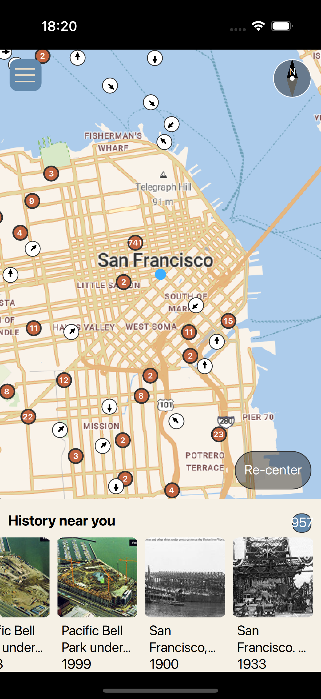
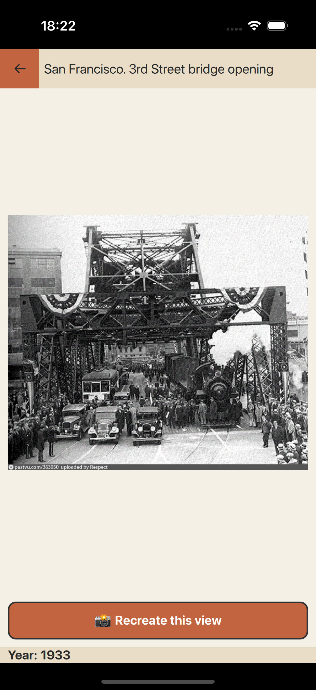

# PastViewer

<p align="center">
  
</p>

<p align="center">
  <strong>A pocket time machine for the places around you.</strong>
</p>

<p align="center">
  Explore geotagged historical photos on a live map, filter them by year, and recreate the same view with your camera.
</p>

<p align="center">
  <a href="https://apps.apple.com/rs/app/pastviewer/id6761183383">
    
  </a>
  <a href="https://play.google.com/store/apps/details?id=org.qtproject.PastViewer">
    
  </a>
</p>

<p align="center">
  <a href="#experience">Experience</a> ·
  <a href="#screenshots">Screenshots</a> ·
  <a href="#features">Features</a> ·
  <a href="#developer-setup">Developer Setup</a>
</p>

## Experience

PastViewer turns a walk through a city into a visual archive. Open the map, follow your current position, and discover historical photos from the streets, squares, and buildings nearby.

When a photo catches your eye, open it full screen, inspect the details, then switch into camera mode to line up the past with the present and share the result.

## Screenshots

<p align="center">
  
  
</p>

## Features

| Discover | Compare | Tune |
| --- | --- | --- |
| Browse historical photos on an interactive map. | Pinch, pan, and study full-size historical photos before recreating the view. | Filter by timeline, nearby items, and current map area. |
| Follow your location, recenter instantly, and explore clustered markers. | Use camera mode to capture a present-day match and share it from the app. | Replay onboarding tips and reload map items without restarting the app. |

## Built For

- Curious walkers who want to see what stood here before.
- Travelers looking for historical context without leaving the map.
- Local historians and photographers recreating archival viewpoints.
- Mobile-first exploration across Android, iOS, and desktop builds.

The app currently includes translations for English, German, Spanish, French, Italian, Japanese, Korean, Portuguese, Russian, Serbian, and Simplified Chinese.

## Developer Setup

### Requirements

- CMake 3.28 or later
- Qt 6.10.2 or later
- Conan
- C++20-compatible compiler
- Stadia Maps API key
- Sentry DSN

For Android builds, install Android SDK API 26+, Android NDK 26.3 or later, and JDK 17 or later. For iOS builds, configure a valid Apple team and provisioning profile through CMake options.

### Configure Keys

```bash
-DOSM_API_KEY=your-stadiamaps-api-key
-DSENTRY_DSN=your-sentry-dsn
```

Create a Stadia Maps key at [stadiamaps.com](https://stadiamaps.com/). Use a private or environment-specific Sentry project for `SENTRY_DSN`.

### macOS Build

```bash
pip install conan
mkdir -p build
cd build

conan install .. --output-folder=. --build=missing \
  -s build_type=Debug \
  -s compiler.cppstd=20

cmake .. \
  -DCMAKE_BUILD_TYPE=Debug \
  -DCMAKE_PREFIX_PATH=/path/to/Qt/6.9.2/macos \
  -DOSM_API_KEY=your-stadiamaps-api-key \
  -DSENTRY_DSN=your-sentry-dsn

cmake --build . --config Debug
```

### iOS Build

Install Xcode, the Qt iOS package, and the matching Qt macOS host package. You also need an Apple Developer team, a provisioning profile, and the app bundle identifier you want to sign.

```bash
mkdir -p build-ios-release
cd build-ios-release

conan install .. --output-folder=. --build=missing \
  --profile:host=../profiles/ios-device \
  --profile:build=default

cmake .. \
  -DCMAKE_BUILD_TYPE=Release \
  -DCMAKE_TOOLCHAIN_FILE=/path/to/Qt/6.10.2/ios/lib/cmake/Qt6/qt.toolchain.cmake \
  -DQT_HOST_PATH=/path/to/Qt/6.10.2/macos \
  -DAPPLE_TEAM_ID=your-apple-team-id \
  -DAPPLE_PROVISION_PROFILE_NAME="Your Provisioning Profile" \
  -DAPPLE_APP_REVERSED_DOMAIN=com.example.pastviewer \
  -DOSM_API_KEY=your-stadiamaps-api-key \
  -DSENTRY_DSN=your-sentry-dsn

cmake --build .
```

### Android Build

```bash
export ANDROID_SDK_ROOT="/path/to/Android/sdk"
export ANDROID_NDK_ROOT="${ANDROID_SDK_ROOT}/ndk/26.3.11579264"
export JAVA_HOME="/path/to/jdk-17"

mkdir -p build-android-release
cd build-android-release

conan install .. --output-folder=. --build=missing \
  -s build_type=Release \
  -s os=Android \
  -s os.api_level=26 \
  -s arch=armv8 \
  -s compiler.cppstd=20

cmake .. \
  -DCMAKE_BUILD_TYPE=Release \
  -DCMAKE_TOOLCHAIN_FILE=/path/to/Qt/6.9.2/android_arm64_v8a/lib/cmake/Qt6/qt.toolchain.cmake \
  -DANDROID_SDK_ROOT="${ANDROID_SDK_ROOT}" \
  -DANDROID_NDK="${ANDROID_NDK_ROOT}" \
  -DQT_HOST_PATH=/path/to/Qt/6.9.2/macos \
  -DOSM_API_KEY=your-stadiamaps-api-key \
  -DSENTRY_DSN=your-sentry-dsn

cmake --build .
```

Install the generated APK with:

```bash
adb install -r android-build/build/outputs/apk/release/android-build-release-unsigned.apk
```

VS Code users can also run the project tasks from `.vscode/tasks.json`.

